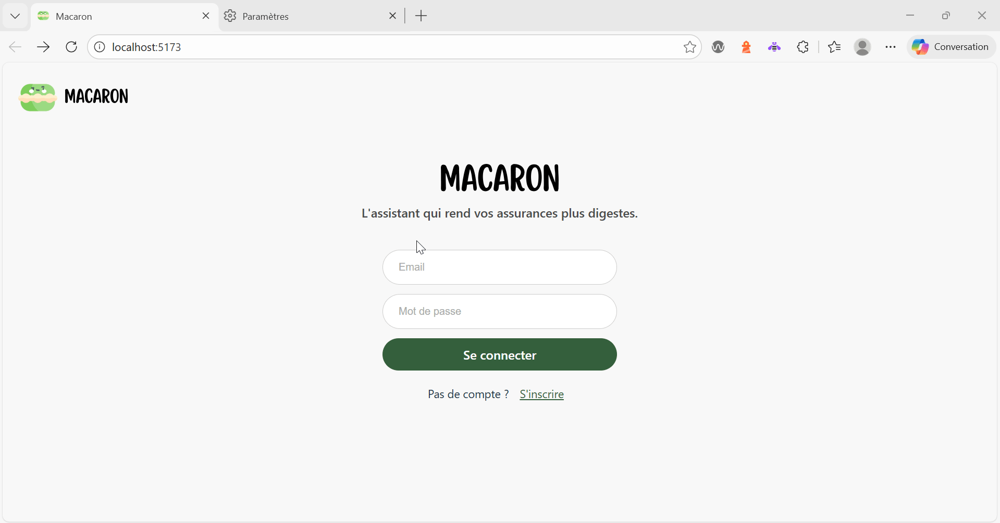

# Personal Insurance Chatbot — Fullstack JS (Vite + Express + MongoDB)

Proof of Concept (POC) fullstack à déployer en local, permettant à un utilisateur de poser des questions sur ses contrats d’assurance via un chatbot, sans exposer ses données personnelles à des services LLM tiers.



## Contexte du projet

Projet fil rouge réalisé dans le cadre de la formation "Chef de projet IA -- Wild Code School / Simplon", avec pour objectif de concevoir un prototype fonctionnel mettant l’accent sur l’architecture, la sécurité des données et l’intégration de technologies LLM (RAG).

## Objectifs du projet

Développer une application capable d'assister un utilisateur dans la compréhension de ses contrats d'assurance, à l'aide d'un chatbot intelligent.

## État actuel du projet — Livrables semaine 9

Sécurisation de l'application :

- ✅ Authentification Firebase : mise en place des pages Sign In et Sign Up.
- ✅ Protection des routes backend : middleware de vérification du token Firebase appliqué à l’ensemble des endpoints.
- ✅ Contrôle d’accès : le backend garantit qu’un utilisateur ne peut accéder ou modifier que ses propres ressources (ex. conversations associées à son compte).
- ✅ Gestion et limitation des requêtes : mise en place de rate limiting par utilisateur.
- ✅ Sécurisation de l’upload des PDF (Multer) :
  - limitation de la taille et du nombre de fichiers,
  - filtrage strict des types de fichiers autorisés,
  - génération de noms de fichiers sécurisés,
  - suppression automatique des fichiers après ingestion dans le vector store.
- ✅ Gestion des erreurs :
  - création de classes d’erreurs personnalisées,
  - middleware global d’interception des erreurs,
  - envoi de réponses propres et sûres au frontend, sans exposition d’informations sensibles.
- ✅ Sécurité RAG / LLM :
  - déplacement de l’intégralité de la logique LLM (retriever, appels, streaming) dans le backend,
  - sanitization basique des chunks (regex),
  - encapsulation contrôlée du contexte dans le prompt,
  - séparation claire des rôles (system / context / user),
  - limitation de la longueur des inputs utilisateur.
- ✅ Vector Store multi-utilisateur :
  - chaque utilisateur ne peut modifier que son propre vector store,
  - association obligatoire du vector store à l’utilisateur en base MongoDB avant toute modification.

## Suivis des changements entre les livrables

| Semaine | Tag       | Description                                        | Historique GitHub                                                                     |
| ------- | --------- | -------------------------------------------------- | ------------------------------------------------------------------------------------- |
| 6       | `week-06` | Mise en place de la structure fullstack du chatbot | [Voir commits](https://github.com/J28u/insurance_assistant/compare/204a969...week-06) |
| 7       | `week-07` | Intégration d’un RAG classique                     | [Voir commits](https://github.com/J28u/insurance_assistant/compare/week-06...week-07) |
| 8       | `week-08` | Finalisation d'un POC présentable                  | [Voir commits](https://github.com/J28u/insurance_assistant/compare/week-07...week-08) |
| 9       | `week-09` | Sécurisation de l'app                              | [Voir commits](https://github.com/J28u/insurance_assistant/compare/week-08...week-09) |

## 📁 Structure du projet

```
.
├── backend/                        # Backend Node.js : API Express + Mongoose (MongoDB)
│   └── src/
│       ├── errors/                  # Traduit les erreurs techniques en erreurs métier compréhensibles et normalisées
│       ├── middlewares/
│       │   ├── errorHandler.js     # Middleware Express pour envoyer une réponse claire au frontend avec le bon status code
│       │   ├── validateRequest.js  # Middleware Express pour valider les paramètres d'une requête
│       │   └── verifyFirebaseToken.js # Middleware Express pour vérifier un token Firebase ID
│       │
│       ├── models/                 # Schémas Mongoose pour les collections MongoDB
│       │   ├── Conversation.js
│       │   ├── Message.js
│       │   └── User.js
│       │
│       ├── routes/                 # Routes Express pour l'API REST
│       │   ├── chat.js             # Routes pour la gestions des appels au LLM
│       │   ├── conversations.js    # Routes pour la gestion des conversations
│       │   ├── upload.js           # Routes pour le chargement des documents pdfs
│       │   └── users.js            # Routes pour la gestion des utilisateurs
│       ├── services/
│       │   ├── conversations.js
│       │   └── retriever.js
│       ├── utils/
│       ├── firebaseAdmin.js        # Initialisation du SDK Firebase Admin côté serveur
│       └── index.js                # Point d'entrée backend : connexion DB et configuration des routes
│
├── frontend/                       # Frontend React (Vite)
│   ├── public/                     # Fichiers statiques accessibles par le navigateur
│   └── src/
│       ├── assets/                 # Images, polices, etc.
│       ├── components/             # Composants React réutilisables
│       │   ├── Chat.jsx
│       │   ├── Conversation.jsx
│       │   ├── LLMInput.jsx
│       │   ├── Home.jsx
│       │   ├── Library.jsx
│       │   ├── SignIn.jsx
│       │   └── SignUp.jsx
│       ├── App.jsx                 # Composant racine de l'application
│       ├── firebase.js             # Initialisation du SDK Firebase côté client
│       ├── index.css               # Styles globaux
│       ├── main.jsx                # Point d'entrée principal React
│       └── style.css               # Styles spécifiques (boutons, spinner, etc.)
│
├── kedro_pipelines/                # Pipelines de Machine Learning/Data avec Kedro
│   ├── conf/                       # Configuration Kedro (catalogues, paramètres, logs, prompts)
│   │   ├── base/
│   │   │   ├── catalog.yml         # Définition des datasets (inputs/outputs)
│   │   │   └── parameters.yml      # Paramètres globaux des pipelines
│   │   ├── local/
│   │   │   └── credentials.yml     # Secrets et credentials (non versionnés)
│   │   ├── prompt_template/
│   │   │   └── prompt_assistant.txt # Template de prompt pour le RAG (contexte + question)
│   │   ├── logging.yml             # Configuration des logs Kedro
│   │   └── README.md               # Documentation des configs (générée par Kedro)
│   ├── data/                       # Données du pipeline (non versionnées)
│   ├── src/
│   │   └── rag/                    # Package principal Kedro
│   │       ├── custom_datasets/    # Datasets personnalisés (ex: FAISS)
│   │       │   └── faiss_vectorstore_dataset.py
│   │       ├── pipelines/
│   │       │   ├── embedding/      # Pipeline d'embedding (vectorisation des documents)
│   │       │   │   ├── nodes.py
│   │       │   │   └── pipeline.py
│   │       │   └── rag_classic/    # Pipeline RAG classique (retrieval + prompt)
│   │       │       ├── nodes.py
│   │       │       └── pipeline.py
│   │       ├── __main__.py         # Entrée CLI du package Kedro
│   │       ├── pipeline_registry.py# Déclaration des pipelines disponibles
│   │       ├── run_kedro.py        # Script de lancement d'un pipeline via kedro-boot
│   │       └── settings.py         # Hooks et configuration avancée Kedro
│   └── pyproject.toml              # Packaging, dépendances et config du sous-projet Kedro
│
├── requirements.txt                # Dépendances Python globales du projet
├── .gitignore                      # Fichiers et dossiers à ignorer par git
└── README.md                       # Documentation principale du projet
```

## 🚀 Installation

### Prérequis

- Node.js (v18+ recommandé)
- MongoDB (local ou en ligne via MongoDB Atlas)

### 1. Cloner le projet

```bash
git clone https://github.com/J28u/insurance_assistant.git
cd insurance_assistant
```

### 2. Créer un fichier .env

- Copier le fichier exemple fourni et remplir avec vos informations :

```bash
cp backend/src/.env.example backend/src/.env
```

- Modifier ensuite les variables avec vos clés locales / Firebase

### 3. Créer une base MongoDB (pour l'historisation des conversations)

- appeler cette base 'chatbotdb'
- renseigner la variable suivante dans .env :

```env
MONGODB_URL = mongodb+srv://<db_username>:<db_password>@cluster0.agni83b.mongodb.net/chatbotdb?retryWrites=true&w=majority&appName=Cluster0
```

### 4. Installer les dépendances Python (Kedro, LangChain, etc.)

```bash
pip install -r requirements.txt
```

### 5. Déployer le LLM

- [installer Ollama](https://ollama.com/download)
- télécharger le modèle choisi :

```
ollama pull gemma3:4b-it-q4_K_M
```

- renseigner le nom du modèle dans le fichier .env :

```env
 MODEL_CHAT = "gemma3:4b-it-q4_K_M"
```

- lancer le serveur en arrière plan :

```bash
ollama serve
```

### 6. Déployer le backend

- installer les dépendances :

```bash
cd backend
npm install
```

- lancer l'api :

```bash
cd src
node index.js
```

### 7. Déployer le frontend

- installer les dépendances :

```bash
cd frontend
npm install
```

- lancer l'application :

```bash
cd src
npm run dev
```

### 8. Utilisation des pipelines Kedro

#### Changer le modèle d'embedding utilisé par le rag:

- Le chargement d'un pdf, entraine la création d'un vectorstore FAISS, sauvegardé localement dans ['data/04_feature/'](kedro_pipelines/data/04_feature/)
- Aller dans [conf/base/parameters.yml](kedro_pipelines/conf/base/parameters.yml)

```bash
embedding_model_name: "OrdalieTech/Solon-embeddings-large-0.1"
```

Par défaut, [Solon-embeddings-large-0.1](https://huggingface.co/OrdalieTech/Solon-embeddings-large-0.1) est utilisé.

#### Lancer un pipeline Kedro

- Le dossier [src](kedro_pipelines/src) contient des "packages" Kedro, chaque 'package' contient plusieurs pipelines répertoriés dans un fichier [pipeline_registry](kedro_pipelines/src/rag/pipeline_registry.py).

- Pour choisir quel 'package' faire tourner, il faut modifier le fichier [pyproject.toml](kedro_pipelines/pyproject.toml)

```bash
[tool.kedro]
package_name = "rag"
```

- Pour exécuter un pipeline du package selectionné : kedro run --pipeline <nom_du_pipeline>

```bash
kedro run --pipeline embedding
```

Vous trouverez les noms de pipelines à exécuter dans [pipeline_registry](kedro_pipelines/src/rag/pipeline_registry.py). Par exemple: embedding, classic_rag.

Pour plus d'options, veuillez consulter la documentation [Kedro](https://docs.kedro.org)

#### Bonnes pratiques Kedro

- Ne supprimez aucune ligne du fichier .gitignore fourni.
- Ne versionnez pas de données dans votre dépôt. Gardez les dans ['data/'](kedro_pipelines/data)
- Ne versionnez pas de mots de passe ou de configuration locale dans votre dépôt. Gardez toutes vos informations sensibles et configurations locales dans ['conf/local/'](kedro_pipelines/conf/local/).

## 📡 API - Endpoint principaux

- POST /api/conversations/ : créer une nouvelle conversation
- GET /api/conversations/user/:userId : récupérer les conversations d’un utilisateur
- GET /api/conversations/onlyone/:conversationId : récupérer les messages d’une conversation
- POST /api/upload/ : charger des pdfs, les découper en chunks et sauvegarder leurs embeddings dans une base vectorielle.

## 🧩 Composants React

- LLMInput.jsx : champ de message + boutons pour interagir avec le LLM
- Conversation.jsx : affichage de la conversation (titre, messages utilisateur et LLM)
- App.jsx : assemble l’interface

## ✨ Fonctionnalités

- Création d'une conversation
- Envoi de messages à un LLM
- Historisation dans MongoDB
- UI dynamique avec React

## 📚 Sources

- Tutoriel Clone de DeepSeek : [Youtube](https://www.youtube.com/watch?v=y3K4hji9W8g)
